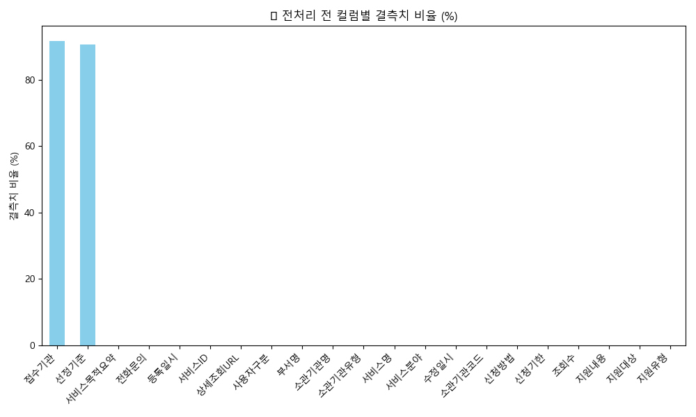
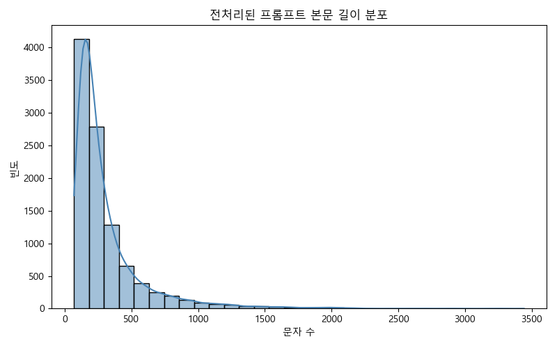
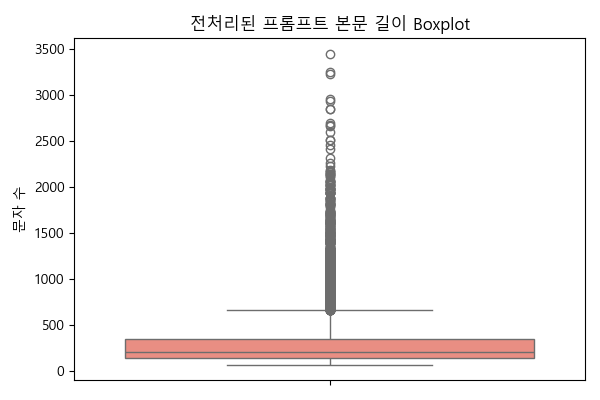
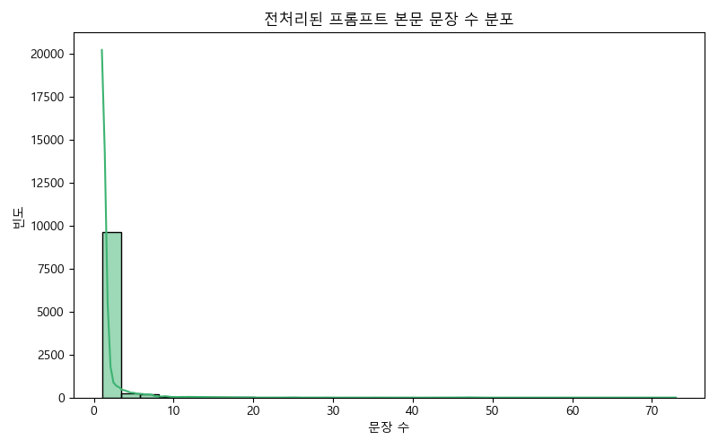
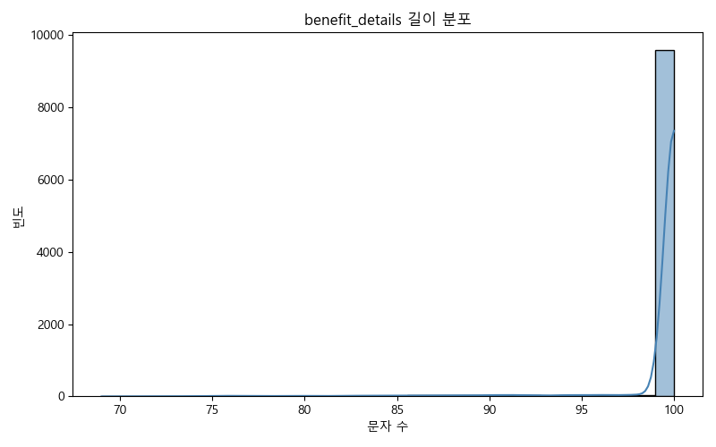
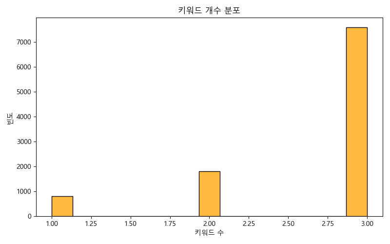
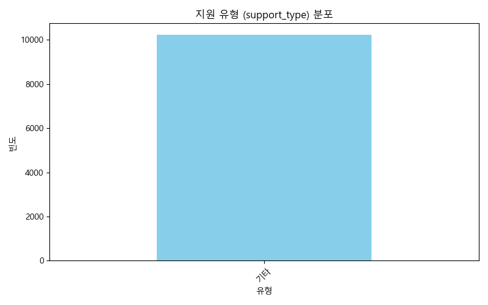

# Fundit Policy RAG Data Pipeline

교육 과정 최종 프로젝트에서 제안한 공공 정책 데이터 기반 RAG 챗봇 아이디어의 데이터 전처리 및 LLM 입력 구조화 파트입니다.

이 저장소는 최종 챗봇 서비스 전체 구현본이 아니라, 공공 정책 데이터를 RAG와 챗봇 서비스에 활용할 수 있도록 정제하고, LLM 입력/응답 품질을 분석한 포트폴리오용 기록입니다.

## 프로젝트를 시작한 이유

이 프로젝트는 교육 과정 최종 프로젝트에서 제가 제안한 아이디어를 바탕으로 시작되었습니다.

당시 저는 공공 데이터, RAG, 챗봇이라는 세 가지 요소를 결합하면 포트폴리오에서 기술적으로 보여줄 수 있는 범위가 넓고, 실제 사용자 문제와도 연결될 수 있다고 판단했습니다. 공공 정책 및 복지 정보는 데이터 자체는 공개되어 있지만, 사용자 입장에서는 자신의 상황에 맞는 정책을 찾기 어렵고, 정책 설명 또한 긴 비정형 텍스트로 제공되는 경우가 많습니다.

따라서 단순히 데이터를 목록으로 보여주는 것이 아니라, 정책 정보를 구조화하고 검색 가능한 형태로 만든 뒤, 사용자가 자연어로 질문하면 관련 정책을 추천하거나 설명해주는 챗봇 형태로 확장할 수 있다고 보았습니다.

저는 이 프로젝트에서 전체 아이디어 기획과 데이터 전처리 파트를 담당했습니다. 특히 원본 공공 정책 데이터에서 불필요한 컬럼을 제거하고, 정책명, 지원대상, 지원내용, 신청방법 등 LLM 입력에 필요한 정보를 선별했습니다. 이후 각 정책 데이터를 프롬프트 입력에 적합한 형태로 재구성하고, LLM 응답 결과를 분석할 수 있도록 JSON/CSV 구조의 중간 산출물을 설계했습니다.

## 담당 역할

- 공공 정책 데이터 기반 RAG 챗봇 아이디어 제안
- 프로젝트 주제 선정 및 활용 시나리오 설계
- 원본 공공 데이터 컬럼 분석
- 정책명, 지원대상, 지원내용, 신청방법 등 핵심 텍스트 필드 선별
- LLM 입력용 프롬프트 데이터셋 구성
- 프롬프트 길이, 제목 길이, 문장 수 등 입력 품질 분석
- LLM 응답 결과의 필드별 품질 분석
- 후속 RAG/챗봇 구현을 위한 구조화 데이터 설계

## 프로젝트 흐름

```text
공공 정책 원본 데이터
→ 원본 데이터 EDA 및 컬럼 선별
→ LLM 입력용 프롬프트 데이터셋 구성
→ 정책별 구조화 응답 생성 실험
→ LLM 응답 결과 품질 분석
→ RAG/챗봇 입력 데이터로 활용 가능한 구조 검토
```

## 쉽게 반영한 개선과 보류한 개선

이번 포트폴리오 정리에서는 기존 코드 흐름을 크게 바꾸지 않고, 바로 이해도를 높일 수 있는 문서화와 데이터 정리를 우선했습니다.

바로 반영한 것:

- 프로젝트 목적과 담당 역할 명확화
- 원본 CSV와 LLM 결과 JSON/CSV 제거
- `.gitignore`, `.env.example`, `requirements.txt` 추가
- LLM 입력 프롬프트 예시와 구조화 응답 예시 문서화
- 입력 품질 분석과 응답 품질 분석의 의미 정리

추후 보류한 것:

- `src/`, `docs/`, `reports/` 기반 폴더 구조 리팩터링
- 실제 RAG 검색 파이프라인 구현
- 벡터 DB 연결 및 retrieval 성능 평가
- 챗봇 UI 구현
- 테스트 코드 작성

## 사용 기술

- Python
- pandas
- matplotlib, seaborn
- nltk
- python-dotenv
- Gemini API 기반 LLM 구조화 실험

## 저장소 구조

```text
.
├── 0_0.ori_data_preprocessing.py       # 원본 데이터 확인 및 결측치 EDA
├── 0_1_graph_isnull.py                 # 원본 데이터 결측치 시각화
├── 1_0_llm_data_preprocessing.py       # LLM 입력용 프롬프트 데이터셋 생성
├── 1_1_graph_promptlen_stats.py        # 프롬프트 길이/문장 수 분석
├── 2_0_llm_prompt_generation.py        # 정책별 구조화 응답 생성 실험
├── 2_1_LLM_Response_Analysis.py        # LLM 응답 필드 품질 분석
├── 3_0_llm_code_preprocessing.py       # 응답 결과 후처리
├── 1.data/                             # 원본/중간 데이터 위치, 실제 데이터는 제외
├── 2.llm_result/                       # LLM 응답 결과 위치, 실제 결과는 제외
├── 2.obsidian_notes/                   # 프로젝트 노트와 분석 기록
├── 3.images/                           # 대표 시각화 결과
├── requirements.txt
└── README.md
```

## 주요 작업

### 1. 원본 공공 정책 데이터 확인

원본 데이터는 정책명, 지원내용, 지원대상, 신청방법, 소관기관 등 다양한 텍스트 필드를 포함하고 있었습니다. 이 중 RAG/챗봇 입력에 직접적으로 필요한 필드를 선별하고, 결측치와 텍스트 길이 분포를 확인했습니다.

대표 시각화:



### 2. LLM 입력용 프롬프트 데이터셋 구성

정책별로 흩어져 있는 비정형 텍스트를 아래와 같은 형태로 재구성했습니다.

```text
제목: 정책명
본문:
- 등록일시
- 지원대상
- 지원내용
- 신청기한
- 신청방법
```

이 단계의 목표는 LLM이 정책 정보를 일관된 형식으로 읽고, 이후 JSON 형태의 구조화 응답을 만들 수 있도록 입력 품질을 정리하는 것이었습니다.

전처리 전 원본 데이터는 정책별로 여러 컬럼에 정보가 흩어져 있었습니다.

```text
서비스명: 청년 월세 지원
지원대상: 만 19세 이상 34세 이하 청년
지원내용: 월세 일부 지원
신청기한: 상시 또는 지자체별 상이
신청방법: 온라인 신청 또는 관할 기관 방문
```

이를 LLM 입력에 적합하도록 아래처럼 제목과 본문 중심의 프롬프트 데이터셋으로 정리했습니다.

```text
제목: 청년 월세 지원

본문:
등록일시: 2025-03-04
지원대상: 만 19세 이상 34세 이하 청년
지원내용: 월세 일부 지원
신청기한: 상시 또는 지자체별 상이
신청방법: 온라인 신청 또는 관할 기관 방문
```

### 3. 프롬프트 입력 품질 분석

LLM 입력은 길이가 너무 길거나 정보가 부족하면 응답 품질이 흔들릴 수 있습니다. 그래서 프롬프트 본문 길이, 제목 길이, 제목 단어 수, 문장 수를 분석했습니다.

대표 시각화:







### 4. LLM 응답 결과 분석

정책별 구조화 응답 결과를 기준으로 `benefit_details`, `keywords`, `support_type`, `benefit_category`, `application_method` 등의 필드를 분석했습니다.

분석 과정에서 일부 필드는 의미 있는 분포를 보였지만, 일부 필드는 default 값만 반복되어 프롬프트 또는 입력 데이터 개선이 필요하다는 점을 확인했습니다.

구조화 응답은 아래와 같은 형태를 목표로 했습니다.

```json
{
  "area": "전국",
  "district": "",
  "min_age": 19,
  "max_age": 34,
  "gender": "전체",
  "support_type": "현금",
  "application_method": "온라인 신청",
  "benefit_category": "주거",
  "benefit_details": "청년 월세 일부를 지원하는 정책",
  "keywords": ["청년", "월세", "주거"]
}
```

응답 분석에서 확인한 점:

- `benefit_details`와 `keywords`는 입력 텍스트를 요약하거나 검색 키워드로 활용할 가능성이 있었습니다.
- `support_type`, `benefit_category`, `application_method`는 default 값이 반복되는 경우가 있어 프롬프트 개선이 필요했습니다.
- 실제 RAG 파이프라인으로 확장하려면 metadata 설계와 응답 검증 로직이 필요하다는 점을 확인했습니다.

대표 시각화:







## 데이터 안내

원본 CSV와 LLM 응답 JSON/CSV 파일은 저장소에서 제외했습니다.

이유:

- 파일 크기가 큼
- 중간 산출물 성격이 강함
- 포트폴리오 저장소에서는 핵심 코드, 분석 흐름, 대표 결과 이미지 중심으로 보여주는 것이 적합함

따라서 이 저장소는 바로 실행 가능한 완전한 재현 저장소라기보다, 공공 정책 데이터를 LLM/RAG 서비스에 활용하기 위해 어떤 방식으로 정제하고 구조화했는지를 보여주는 포트폴리오용 저장소입니다.

## 실행 방법

데이터 파일을 보유한 경우 아래 순서로 실행할 수 있습니다.

```bash
python3 -m venv .venv
source .venv/bin/activate
pip install -r requirements.txt
```

원본 데이터 확인:

```bash
python 0_0.ori_data_preprocessing.py
python 0_1_graph_isnull.py
```

프롬프트 데이터셋 생성:

```bash
python 1_0_llm_data_preprocessing.py
```

프롬프트 입력 품질 분석:

```bash
python 1_1_graph_promptlen_stats.py
```

LLM 응답 생성 및 분석:

```bash
python 2_0_llm_prompt_generation.py
python 2_1_LLM_Response_Analysis.py
python 3_0_llm_code_preprocessing.py
```

## 한계와 회고

- 이 저장소는 최종 챗봇 서비스 전체 구현본이 아닙니다.
- 제 담당 범위는 프로젝트 기획과 데이터 전처리/구조화에 집중되어 있습니다.
- 실제 RAG 검색 품질 평가, 벡터 DB 구축, 챗봇 UI 구현은 저장소의 핵심 범위에 포함되어 있지 않습니다.
- 다만 RAG 기반 챗봇에서 검색 품질의 기반이 되는 입력 데이터 정제, 프롬프트 구성, 응답 필드 분석 과정을 경험했다는 점에 의미가 있습니다.

## 다음 개선 방향

- `src/`, `docs/`, `reports/` 기반 구조로 리팩터링
- 정책 데이터 스키마 문서화
- 실제 RAG chunk 설계 및 metadata 전략 추가
- 벡터 DB 연결 실험
- 챗봇 응답 평가 기준 설계
- Streamlit 또는 FastAPI 기반 간단한 검색 UI 구현
